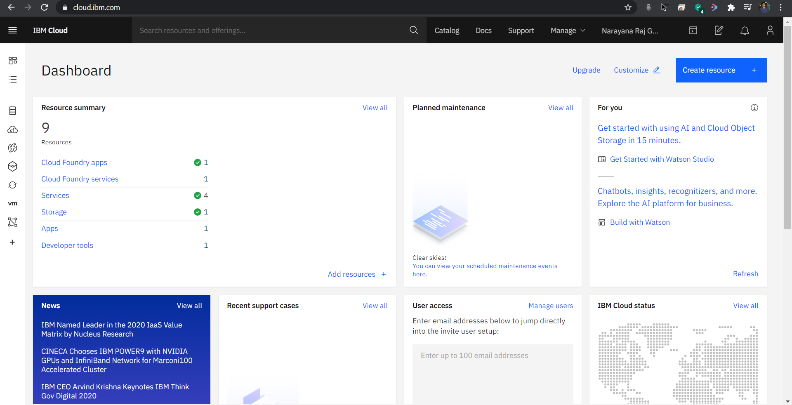
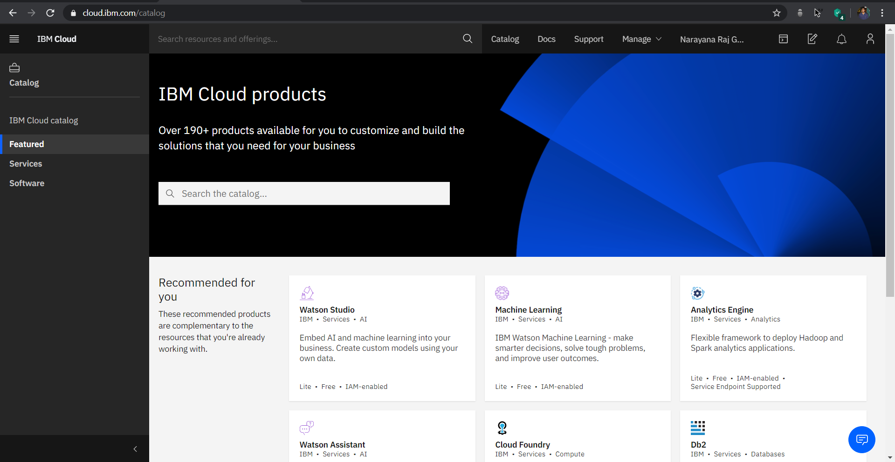
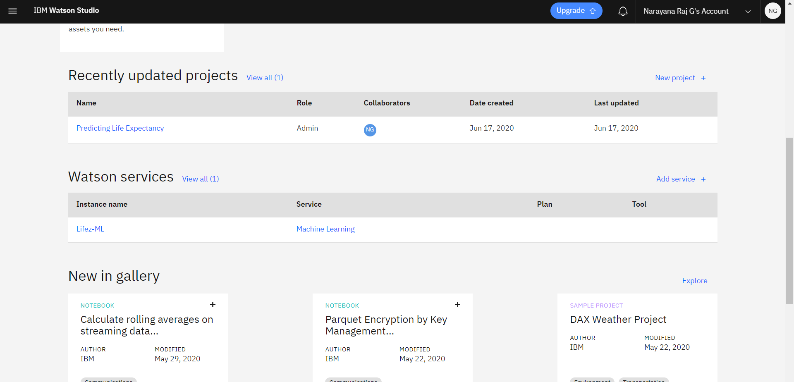
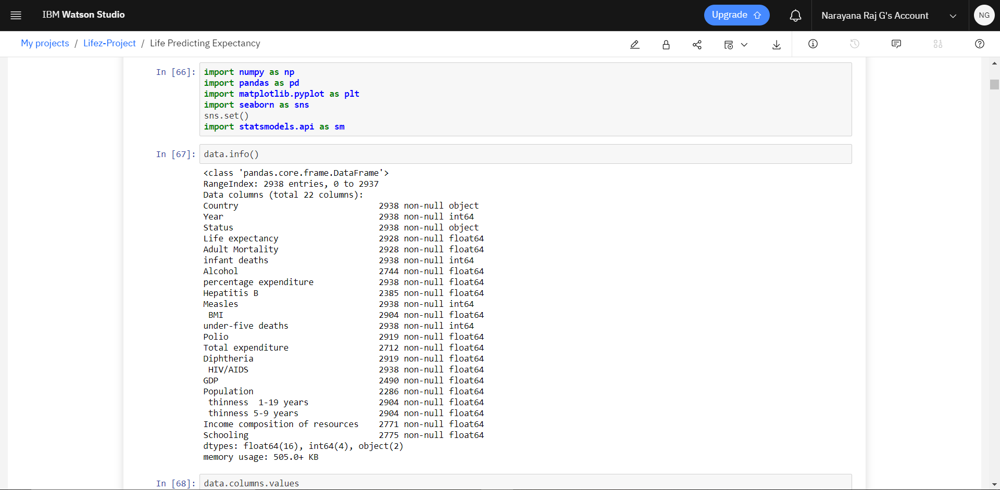
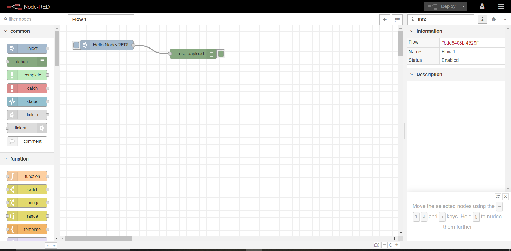
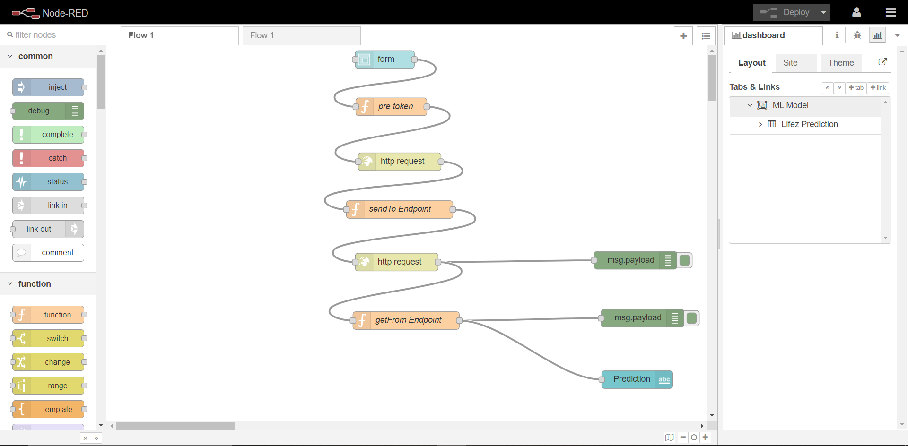
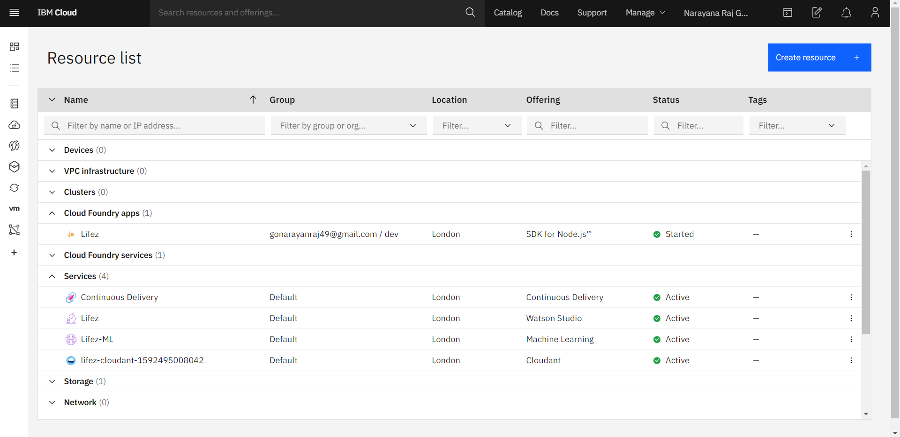
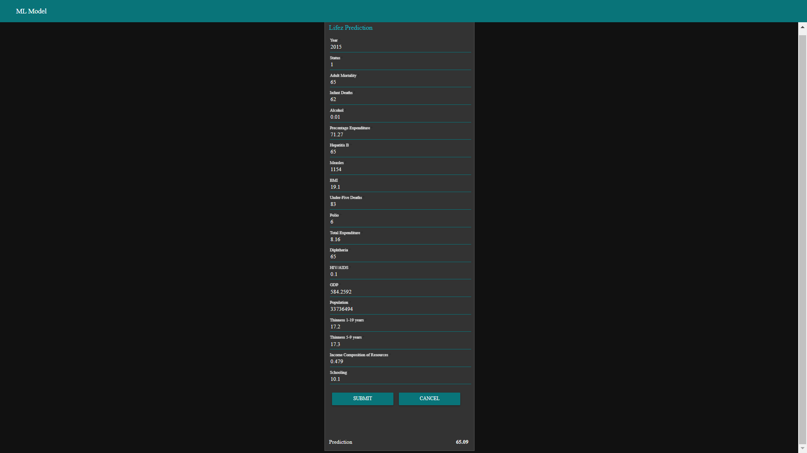

# Predicting Life Expectancy using Machine Learning
Lifez Prediction

# Project Summary:
This project aims to predict the lifespan of a human being, based on various factors such
as Regional variations, Economic Circumstances, Mental Illnesses, Physical Illnesses, Eduaction,
Year of their birth and other demographic factors which is in a dataset that was collected by
WHO and United Nations website. This project finds the expected solution using various
machine learning algorithms such as: Linear Regression, Logistic Regression, SVM, Clustering,
and Polynomic Regression. Using these ML Algorithms, we have to find the relationship of the
various factors with the lifespan of an individual. 

The dataset used for the prediction contains data from year 2000 to 2015. It contains more than
2500 entries and around 22 columns with various features like Population, Status, Alcohol, Infant
Deaths etc., which aids the prediction of the model.

# Project Requirements:
1. The dataset must be in csv format.
2. Machine Learning Algorithms must be applied with the help of Python.
3. IBM cloud account.
4. IBM Watson and Node-Red flow.

# IBM Cloud Platform:
The IBM cloud platform combines platform as a service (PaaS) with infrastructure as a service (IaaS) to provide an integrated experience. The platform scales and supports both small development teams and organizations, and large enterprise businesses. Globally deployed across data centers around the world, the solution you build on IBM Cloud spins up fast and performs reliably in a tested and supported environment you can trust.

# Deploying ML model in IBM Cloud:
Steps:
> Go to the IBM Cloud Portal (If you don't have an account, please create it)

> Now go to Catalog section where you get Watson Studio service, Machine Learning service and Node-red application. Search for these services.

You can download the dataset from kaggle website.
> Create one by one services in catalog. 
> After creating Watson Studio service and Machine Learning service, we should create a project.

> Inside that we have to create a notebook where we can write our python code and import our downloaded dataset. Then by using our ML service credential, we get a scoring end-point.

> Then we have to create Node-red application (flow based development tool) for UI part in catalog section.

> Here we have to build the flow. For form node, we have to install palette from manage palette option.

> After creating all the required services and application, our Resource List looks like

> Finally we have to deploy our project.

Take a look of my project by clicking the link,
https://lifez.eu-gb.mybluemix.net/ui/#!/0?socketid=aU2Se0V9vVs-hfEkAAAG

Thanks for giving a read...

Some useful links:
https://cloud.ibm.com/login
https://www.ibm.com/cloud/get-started
https://developer.ibm.com/technologies/machine-learning/series/learning-path-machine-learning-for-developers/
https://www.ibm.com/watson/products-services
https://bookdown.org/caoying4work/watsonstudio-workshop/jn.html
https://www.kaggle.com/kumarajarshi/life-expectancy-who
https://developer.ibm.com/tutorials/how-to-create-a-node-red-starter-application/
